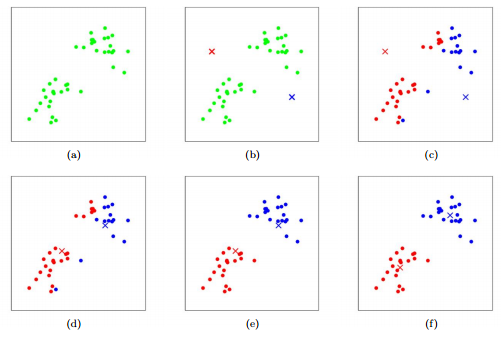
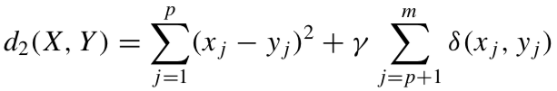

# Unsupervised Learning

#### Guilherme Amorim

A gentle introduction to Unsupervised Learning: K-Means and K-Modes.

## What is Unsupervised Learning?

Before trying to give the definition - or a concept - about Unsupervised Learning it is nice to review what do we mean when we say Learning: "We are searching something we can learn from a dataset that can be applicable, or that we can *generalize* for every data outside the dataset".

I'll try giving one example: suppose we meant to solve the problem of finding out if a person has the flu. For this problem we are given a dataset that contains lots of information about past patients: age, sex, symptoms and the prognostic. When we say we want to learn from data, in this context, we mean that we want to generalize any information we can get from this dataset to every new dataset. We could, for supervised learning, is to learn information about each feature and try to predict a new patient with having the flu or not. We learn this by looking at the set of historical patients already labeled for us (with having the disease or not) and run an algorithm to learn something from the data: the algorithm learns trying to guess a preditcion on the dataset, if it fails, i.e. predicts not having the flu when the historical patient on the set had the disease, we give back the response of the failure and, in the next round, it will try to change its internal weights or internal structures to succeed.

In the example given above we see that the label, or the output information, is very important for the supervised learning. 

<u>In the context of the **unsupervised learning** there is no output information at all</u>, **but there is still information to be learnt**: we can "spontaneously find patterns and structure on the *input data*". For the previous example we can try to find patterns on patients features and identify patients that have similar behavior, putting them in one category without naming that category. That also means that we can use this paradigm to **create a higher-level representation of data**.

## Clustering Analysis

As stated before, the clustering analysis can be found on the unsupervised learning paradigm: we find patterns of similarity (or dissimilarity) on the input data. This method can be applied as a stand-alone tool to get insight into data distribution or can be used as a preprocessing step for other algorithms (in supervised field, for example).

The most common use is in Marketing, where we could use clustering methods to discover distinct groups in customer bases and create specific marketing campaigns to focus theses different groups.

We can also use an evolutive cluster analysis looking at how the clusters behave in time: sometimes a particular group can, given the passage of time, split into two different groups or even merge with another group.

But how can we assert that a particular set of clusters, given by a trained algorithm, really learned something from the input, or even better, how can we know that unsupervised learning is actually "right" if we don't have ouput information?

There are different tools to validate this particular method/paradigm, but they all focus on one (or both):

1. Look for high <u>intra-class</u> similarity;
2. Look for <u>low inter-class</u> similarity

These concepts both provide that inside a cluster "all objects are similar, look alike" and that objects in different clusters "are very different". We use a *distance function* to calculate similarity/dissimilarity. But there are some challenges here: it is very hard to define if a particular object "similar enough" to be in the same cluster, basically because this can be quite subjective.

There are several approaches to "solve" this kind of "problem":

1. **Partitioning algorithms**: constructs various partitions and then evaluate them by some criterion.
2. Hierarchy algorithms: create a hierarchical decomposition of objects using some criterion.
3. Density algorithms: based on connectivity and density functions
4. Grid-based: based on a multiple-level granularity structure
5. Model-based: a model is hypothesized for each of the clusters and the idea is to find the best fit of that model to each other.

Here we are going to look at two famous methods in the **partitioning algorithms** approach: **K-Means** and **K-Modes**. We are going to explain why we should use one or the other and we will later provide a quick explanation of a method that use both of these methods together.

Our **problem** for each algorithm will be:

`We are given a training set having N data points, x1 (...) xn, with features vectors for each data point, x^i in R^N, but no labels, y^i. Our goal is to predict k centroids and a label, c^i representing cluster membership, for each data point.`

## K-Means

This is an algorithm that was first presented by MacQueen (1967) in "Some methods for classification and analysis of multivariate observations" and basically consists of a "Expectation Maximization" algorithm applied to a particular Naive Bayes model and we are going to explain this in a moment.

To solve the problem, K-Means asks for a number <u>k</u> of clusters and does the following:

In the first step we perform a cluster initialization, randomly putting <u>k</u> cluster centroids on the set space.

For the second step we basically calculate the labels for each data point based on a similarity distance of each point to the cluster centroids, later we update the cluster centroids of each cluster using the mean.

The following image can illustrate theses steps for a clustering problem given 2 features for each data point:

*Here we are given k=2, so the algorithm will find 2 optimal clusters: b) cluster centroids initialization, c) we find cluster membership for the data points using the euclidian distance, d) we update the cluster centroids using the mean of each cluster, e) we update cluster membership for all clusters, f) we update the cluster centroids again.*

So, <u>where are Expectation and Maximization steps in KMeans?</u>

- Expectation here follows the cluster membership step where we assign a cluster for each data point based on the distance to each cluster centroid;
- Maximization here follows computing/updating the centroid of each cluster

### Weaknesses

- K-Means uses the **euclidian distance** function to calculate similarity between data points, that means that **<u>it can't deal well with categorical features</u>** because we can't calculate mean for categories;
- We need to provide K in advance;
- It cannot deal very well with outliers or noisy data;
- Because of the **euclidian distance** function clusters found will have convex shapes;
- Because of the **EM** nature of KMeans we have no guarantee of reaching the <u>global optimum value</u>, only the <u>local optimum value</u> for each cluster;
- **The initial cluster centroids initialization matter** for the problem so maybe two different runs on the algorithm may have different outcomes.

### So how about one-hot encoding categorical features?

Some people argue that K-Means can handle categorical features if we apply a one-hot encoding on the feature transforming the categorical values in numerical ones:

Here we transformed "Food Name" categorical feature into three different categories and each feature is in the range [0, 1]. 

<u>K-Means tend to work because we have binary features</u> but we have the problem of **low discriminability** for each feature. We also are increading the dimensionality of our problem meaning that we could end in the "Curse of Dimensionality": sparsity of the data and closeness begin to affect statistical significance.

Also, can we really understand a value of "Apple = 0.4" and "Chicken = 0.1" for a cluster centroid? What does that mean?

## K-Modes

This algorithm is kind of a categorical response for K-Means not being able to perform at all for <u>categorical features</u>. It was proposed by Huang (1997) in "A Fast Clustering Algorithm to Cluster Very Large Categorical Data Sets in Data Mining".

K-Modes algorithm really behaves just like K-Means but we change the distance function: we use a **dissimilarity function**:

1. Use a simple matching dissimilarity measure for categorical objects,
2. Replace means of clusters by modes, and
3. Use a frequency-based method to find the modes

#### Dissimilarity measure

The dissimilarity measure can be defined by the total mismatches of the corresponding attribute categories of two objects. The smaller the number of mismatches is, the more similar the two objects.

#### Mode of a set

Huang's paper mathematically describes the definition of a mode of K-Modes but here I will provide a simple explanation: the mode of a set *X* is a vector *Q [q1, ..., qn]* in which each feature value corresponds to the mode of the set:

***X = {[a, b], [a, c], [c, d], [b, d]}; Q = [a, d] wich corresponds the modes of each feature, also we can see that Q does not exists in X.***

#### Algorithm

The pseudo-algorithm is then:

1. Select *k* initial modes, one for each cluster.
2. Allocate an object to the cluster whose mode is the nearest it according to the dissimilarity measure. Update the mode of the cluster after each allocation.
3. After all objects have been allocated to clusters, retest the dissimilarity of objects against the current modes. If an object is found such that its nearest mode belongs to another cluster rather than its current one, reallocate the object to that cluster and update the modes of both clusters.
4. Repeat 3 until no object has changed clusters after a full cycle test of the whole dataset.

### What if we have both numerical and categorical values in the data set?

For this kind of problem there are algorithms, but one that is also proposed by Huang is called **K-Prototypes**. It basically merges both **K-Means** and **K-Modes** distance functions to solve the problem:

Where the first term is the **squared Euclidian distance measure** on the <u>numeric attributes</u> and the second term is the **simple matching dissimilarity measure** on the <u>categorical attributes</u>. The weight gamma is used to avoid favouring either type of attribute.

The **EM** algorithm is them run using this new distance function in the **(E)** step and 

## References

Chris Piech. "K Means". https://stanford.edu/~cpiech/cs221/handouts/kmeans.html

David Madigan. "What is Cluster Analysis?". http://www.stat.columbia.edu/~madigan/W2025/notes/clustering.pdf

Yaser S. Abu-Mostafa, Malik Magdon-Ismail, Hsuan-Tien Lin. Learning From Data.

MacQueen, J. (1967). Some methods for classification and analysis of multivariate observations. In *Proceedings of the fifth Berkeley symposium on mathematical statistics and probability*, pp. 281-297.

Huang, Z. (1997) A Fast Clustering Algorithm to Cluster Very Large Categorical Data Sets in Data Mining. in *KDD: Techniques and Applications* (H. Lu, H. Motoda and H. Luu, Eds.), pp. 21-34, World Scientific, Singapore.
