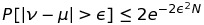
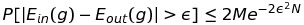

# Learning from Data

## Yaser S. Abu-Mustafa, Malik Magdon-Ismail, Hsuan-Tien Lin

## Annotations

#### Guilherme Gimenez Jr

## Chapter 1 - What is Learning?

One of the greatest examples given by the book is about the definition of a tree. What happens when you ask the definition of a tree to a three year old? You will probably get the answer that a tree is a big brown trunk with various twigs with green leafs on it. What if you make this question to a thirty year old person? You will probably get a totally different answer (maybe even more structure).

That happens because there isn't a mathematical definition of what a tree is (maybe you will find a biological explanation), we learn what a tree is simply by looking at trees: we learned from data. This definition is used often when we have problems that don't actually have an analytical solution, but an emphirical one.

There is some terminology that is used in Machine Learning and that can be explained if we use a simple example:

Suppose that a bank wants to automate the task of giving credit to customers. It knows that there is no magical formula that can pinpoint the decision of giving credit or not, but it also have a lot of data. This calls for learning from historical data, so the bank will use historial records from previous customers to figure out a good formula for credit approval. So, we will do the following: we will gather all the data from customers like: age, salary, number of mortgages, years in residency, outstanding loans, etc. and also the information of a particular credit application for that customer was approved or not at a particular time (if the bank made money from the credit approval on that customer).

Here is the terminology: we have an input *x* (customer information that was used to make a decision of credit approval), an unknown target function *f: X -> Y* (ideal formula for credit approval), where *X* is the input space (set of all possible inputs *x*) and *Y* the output space (set of all possible outputs, in this case a binary decicion of yes or no to a particular credit application). We also have *D*, our data set of input-output examples (*(x1, y1)*, *(x2, y2*), ..., *(xn, yn)*), where *yn = f(xn)* for *n = 1, ..., N* (inputs corresponding to previous customers and the correct credit decision for them in hindsight). Finally, there is a learning algorithm that uses the data set *D* to pick a formula *g: X -> Y* that approximates *f*. The algorithm chooses *g* from a set of candidate formulas under consideration, which we call the hypothesis set *H*. For instance, *H* could be the set of all linear formulas from which the algorithm would choose the best linear fit to the data. When a new customer applies for credit the bank will base its decision on *g* (the hypothesis that the learning algorithm produced), not on *f* (the ideal target function which remains unknown). The decision will be good only to the extend that *g* faithfully replicates *f*. 

#### What Learning is not

There are some related aproaches to solve similar problems, they are called 'Design' approaches and do not use data. Although often discussed alongside the learning approach in pattern recognition literature, the Design approach is completely different from the Learning approach.

The main difference between the Learning approach and the design approach is the role that data plays. In the Design approach, the problem is well specified and one can analitically derive *f* without the need to see any data. In the Learning approach, the problem is much less specified, and one needs data to pin down what *f* is.

Both approaches may be viable in some applications, but only the Learning approach is possible in many applications where the target function is unknown.

#### Other important fields that approach learning from data

**Statistics** shares the basic premise of learning from data, namely the use of a set of observations to uncover an underlying process. In this case, the process is a probability distribution and the observations are samples from that distribution. Because statistics is a mathematical field, emphasis is given to situations where most of the questions can be answered with rigorous proofs. As a result, statistics focuses on somewhat idealized models and analyzes them in great detail. This is the main difference between the statistical approach to learning; we make less restrictive assumptions and deal with more general models than in statistics. Therefore, we end up with weaker results that are nonetheless broadly applicable.

**Data Mining** is a pratical field that focuses on finding patterns, correlations, or anomalies in large relational databases. Technically, data mining is the same as learning from data, with more emphasis on data analysis than on prediction.

#### Is Learning feasible?

One of the main concerns we may have is the following: can we actually learn something from a data set? Can we really trust that *g* maps to *f* in some way?

When we get a training data set *D*, that does means that we know the value of *f* on all the points in *D*, but that does not mean that we have learned *f*, since it doesn't guarantee that we know anything about *f* outside of *D*. 

If the data set *D* tell us anything outside of *D* that we didn't know before we could say that we have learned something, if that didn't happened then we can say that learning is not feasible.

Since we know that *f* is an unknown function, then *f* remains unknown outside of *D*. That happens because we can have infinite functions that match the data set *D* but diverge on any set of points *outside of D*. That means that even if an hypothesis *g* is learned and matches the data set *D*, or not, it makes no difference, because **the perfomance outside of *D* is concerned**.

This is a big dilemma: as long as *f* is an unknown function, knowing *D* cannot exclude any pattern of values for *f* outside of *D*. Therefore, the predictions of *g* outside of *D* are meaningless. 

But probability can help us to prove that we can infer something **outside of *D* using only *D***. We can use that to establish the principle that we can reach outside of *D* and then take this principle to the general Learning problem and pin down what we can and cannot learn.

##### Hoeffding Inequality

Suppose we have a bin full of red and green marbles, possibly infinitely many. The proportion of red and green marbles is such that if we pick a marble at random, the probability that it will be red is *u* and the probability that it will be green is *1 - u*, and we assume that *u* is unknown to us.

We pick a random sample of N independent marbles (with replacement) from this bin, and observe the fraction *v* of red marbles within the sample. What can we say about *v* in the bin?

One answer is that regardless the number of the colors of the N marbles that we picked, we still doesn't know the color of any marble that we didn't pick. We can get mostly green marbles in the sample while the bin has mostly red marbles. Although this is certainly *possible*, it is by no means *probable*.

The **Hoeffding Inequality** can help us to infer that as the sample N grows, it becomes exponentially unlikely that *v* will deviate from *u* by more than our tolerance *E*:

Some things to notice: *v* depends on the random sample, but, by contrast, *u* is not random, it is constant, albeit unknown for us. The utility of the Hoeffding Inequality is to infer the value of *u* using the value of *v*, although it is *u* that affects *v*, not vice-versa. However, since the effect is that *v* tends to be close to *u*, we infer that *u* 'tends' to be close to *v*. Also, although the probability depends on *u*, as *u* appears in the argument and also affects the distribution of *v*, we are able to to bound the probability to the right term which does not depend on *u*. Notice tha only the size *N* of the sample affects the bound, not the size of the bin. The bin can be large or small, finite or infinite, and we still get the same bound when we use the same sample size.

If we choose a very small value for out 'tolerance' *E* in order to make *v* a good approximation of *u*, we need a larger sample size *N* to make the Right-Hand Side of the Inequality small. Although this assertion does not give us the exact value of *u* and doesn't even guarantee that the approximate value holds, knowing that we are within *+/- E* of *u* most of the time is a significant improment over not knwking anything at all.

How does that relate to our problem? In our Learning problem we have an entire function *f -> X, Y* that is unknown and not only a value *u* as we previously discussed. Both situations can be connected:

Take any single hypothesis *h E H* and compare to *f* on each point *x E X*: if *h(x) = f(x)* color the point *x* green. If not they are not equal, color the point *x* red. The color that each point gets is not known to us, since *f* is unknown. However, if we pick *x* at random according to some probability distribution *P* over the input space *X*, we know that *x* will be red with some probability, call it *u*, and green with probability *1 - u*. Regardless of the value of *u*, the space *X* now behaves like the bin.

The training data set play the role of a sample from the bin. If the inputs *x1, ..., xn* in *D* are picked independently according to *P*, we will get a random sample of red - *h(x) != f(x)* - and green - *h(x) = f(x)* - points. Each point will be red with probability *u* and green with probability *1 - u*. The color of each point will be known to us since both *h(xn)* and *f(xn)* are known for *n = 1, ..., N*. 

Here *u* does not really tell us the value of *f* but rather the error rate *h* makes in approximating *f*. If *v* happens to be close to zero, we can predict that *h* will approximate *f* very well over the entire *X* space. If not, we are out of luck.

One thing to remember is that in the learning problem we have no control over *v*, since is based on a particular hypothesis *h*. In real learning, we explore an entire hypothesis set *H* looking for some *h E H* that has a small error rate.

#### Feasibility of Learning

When we make some adjustments to the **Hoeffding Inequality** regarding multiple hypothesis we will reach the following equation:

Where *Ein(g)* is the error on the training data set (in which we have access), *Eout(g)* the error outside the training data set (we don't have access and is unknown to us), *g* is the final hypothesis (*g e H*) and *M* is the size of the set *H*.

Here we know that learning produces a hypothesis *g* to approximate the unknown target function *f*. That means that if we are successful, then *g* should approximate *f* well, which means *Eout(g) ~ 0*. However, this is not what we get from the probabilistic analysis. What we get instead is that *Ein(g) ~ Eout(g)*. We still have to make *Ein(g) ~ 0* in order to conclude that *Eout(g)*. 

###### Complexity of *H*

We can think of the term *M* as the complexity of the hypothesis set *H*. If this number goes up, we are at great risk of *Ein(g)* being a poor estimator of *Eout(g)* according to the Inequality. Here we already have a big tradeoff: we have a better chance to get *Ein(g) ~ 0* if *H* is more complex, giving us more flexibility in finding some *g* that fits the data well, but we also need to have the complexity of *H* in check if we want to have a good estimator of *Ein(g) ~ Eout(g)*.

###### The complexity of *f*

We know by intuition that a complex target function *f* should be harder to learn than a simple *f*. Although the Inequality providing the same bound for a complex *f* or a constant one, it only answers one part of the question: *Ein(g) ~ Eout(g)*. The problem here lies in the *E(in) ~ 0* - again! - if *f* is too complex we will have a hard time trying to fit the training data and get a worse value of *E(in)*. If we try to make our way making *H* more complex we will get *Eout* far away from *Ein*. So, as expected, a complex *f* will be harder to learn, in the extreme case if *f* is too complex, we may not be able to learn at all.

